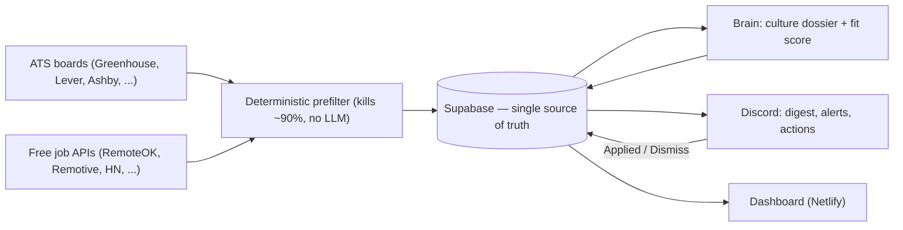

# Job Track OS

**A private, always-on system that catches design roles within an hour of posting, scores each against my actual resume + portfolio, researches the company's culture before I ever apply, and pushes only the ones worth acting on to Discord — for ₹0/month.**

Built by a product designer to run a real job search, and to be honest about the two things that actually matter in one:

1. **Speed** — know about the right role within an hour of it going live, before the applicant pile forms.
2. **Judgment** — never apply somewhere that'll make me miserable, and never *miss* one that wouldn't. The culture research is half the product, not a garnish.

`TypeScript` · `Node 20` · `Supabase (Postgres)` · `GitHub Actions` · `Discord` · `Netlify` · runs at **₹0/month**

---

## Why I built it

Job hunting as a designer is two slow, error-prone loops done by hand: *finding* fresh roles before they're buried under hundreds of applicants, and *researching* whether a company is actually a good place to work (the part that never shows up in a job description). I automated both — and used the build itself as a systems-design and engineering exercise. This repo is that system.

## The core loop

> Every morning I open one Discord digest of scored roles — each with a fit score, a culture read, and a company dossier. I tap **Applied** or **Dismiss** on the card. The system records it and gets sharper. The card *is* the tracker row — there's no spreadsheet to keep in sync.

## Architecture



| Layer | Choice | Why |
|---|---|---|
| Language | TypeScript everywhere | One mental model end to end |
| Collector | Stateless Node scripts | Run, write, die — nothing to babysit |
| Scheduler | GitHub Actions cron | Free, always-on, no server |
| Database | Supabase (Postgres) | **Single source of truth**; its table editor doubles as the UI early on |
| Brain (scoring + culture dossier) | Claude, semi-automated | Two-stage: the LLM only ever sees the ~10% that survive the free prefilter |
| Notifications + actions | Discord webhook + interactions | Alerts and one-tap actions in one surface |
| Functions / dashboard | Netlify Functions + Next.js | Keys stay server-side; personal data never reaches the browser |

## Engineering decisions worth calling out

- **Two-stage filtering for cost control.** A deterministic, rules-only prefilter kills ~90% of postings *before* any LLM call. Company research is cached per company (60-day TTL) and reused across every role. This is what keeps a continuously-running LLM system at effectively ₹0.
- **"There is no sync."** Discord and the dashboard never talk to each other — both are windows onto Supabase. The classic failure mode "tracker and notifications disagree" is made *structurally impossible* rather than patched.
- **Staggered polling by tier.** Dream companies are polled hourly, others every few hours or daily — freshness where it matters, without hammering endpoints.
- **Judgment over matching.** Beyond keyword fit, the system answers explicit culture questions (weekend work? six-day weeks? micromanagement? politics?) from public review signals, each with a confidence level and evidence — and returns "not enough data" instead of inventing a narrative.
- **Defensive by default.** Every fetch is isolated (one company's outage never aborts a run), every filter kill is logged with its reason (so an over-aggressive filter can't silently eat the perfect role), and dedup runs in two passes across sources.

## Status & roadmap

Built in strict, sequential phases — each one runs before the next starts.

- [x] **Phase 1 — the pipe is alive.** ATS collector → Supabase → Discord, proven end-to-end.
- [ ] **Phase 2 — breadth + filter.** All six ATS collectors + free job portals, two-pass dedup, the deterministic prefilter, and the hourly GitHub Actions cron.
- [ ] **Phase 3 — the brain.** Company culture dossier, eligibility model, and the calibrated fit scorer, as rich Discord digests.
- [ ] **Phase 4 — the loop closes.** Discord buttons / modals / slash commands, card-in-place editing, a discovery loop that grows the company list.
- [ ] **Phase 5 — auto-status.** Read-only inbox scan advances a role's status from recruiter emails, with the source shown.
- [ ] **Phase 6 — dashboard.** A private Next.js dashboard on Netlify, reading through serverless functions.

## Repo layout

```
prd/            the product spec (the thinking behind the build)
data/           companies.seed.csv — a curated 158-company starter list
db/schema.sql   the Postgres schema — run once in Supabase
src/
  collectors/   one file per job source
  lib/          supabase client, discord poster, normalise/dedup helpers, config
  scripts/      collect.ts — the runnable pipe
profile.example/  placeholder profile (the format the scorer reads)
profile/          your real profile — git-ignored, never committed
```

---

## Run it yourself

**Prerequisites:** Node.js 20+ and (for the real run) free Supabase + Discord accounts.

```bash
npm install
npm run collect -- --dry-run     # fetches live roles and prints them — no accounts needed
```

<details>
<summary><b>Full setup (~15 min) — Supabase + Discord + .env</b></summary>

### A. Supabase (the database)
1. **supabase.com** → sign in → **New project** (free tier, region nearest you).
2. **SQL Editor** → **New query** → paste all of [`db/schema.sql`](db/schema.sql) → **Run**.
3. **Project Settings → API** → copy the **Project URL** (`SUPABASE_URL`) and the **`service_role`** secret key (`SUPABASE_SERVICE_KEY`).

> ⚠️ The `service_role` key bypasses row security — it stays server-side only, never in a browser or a commit.

### B. Discord (the interface)
1. Create a server → add a text channel **`#alerts`**.
2. **Server Settings → Integrations → Webhooks → New Webhook** → set channel to `#alerts` → **Copy Webhook URL** (`DISCORD_WEBHOOK_URL`).

### C. Wire up `.env` and your profile
```bash
cp .env.example .env               # then paste the three values from A and B
cp -r profile.example profile      # then replace the placeholders with your real resume/portfolio/etc.
```

### Run for real
```bash
npm run collect
```
Success = new rows in Supabase `jobs` and a message in Discord `#alerts`. Run it again a minute later and it writes 0 new jobs and posts nothing — dedup works, and silence is intentional.

</details>

---

## A note on privacy (why this public repo is safe)

This repo is public to share the work, but nothing personal is in it:

- **Profile data** (resume, phone, email, salary, preferences) lives in a **git-ignored `profile/`** folder — the repo ships only `profile.example/` placeholders.
- **The tracker itself** (which companies I've applied to, culture verdicts, statuses) lives in **Supabase, never in the repo.**
- **Secrets** live only in local `.env` and GitHub Actions secrets — never in code, never committed.

## License

MIT — see [`LICENSE`](LICENSE).
